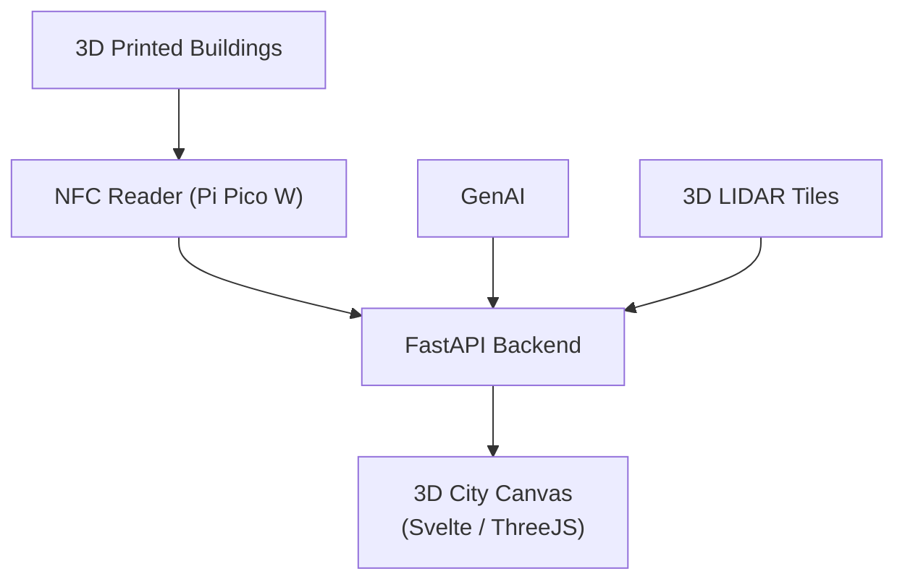
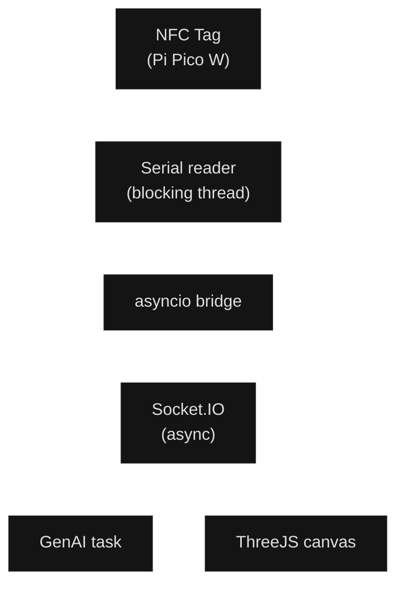
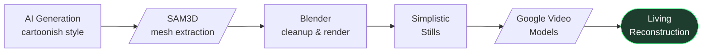

# Replayable Urban Renewal
<div class="text-xl text-secondary font-light mt-2 mb-8">
Letting anyone <em>have-a-go</em> at re-developing their city.
</div>

<div class="abs-bl mx-14 my-12 flex flex-col gap-2">
  <div class="attribution">Damian Bemben</div>
  <div class="attribution--subtle">github.com/dambem</div>
</div>


---

# Who am I?

<div class="grid grid-cols-2 gap-12 mt-8">
<div>

<div class="text-4xl mb-2"></div>

### Damian Bemben

<b>Senior Software Engineer & Creative Technologist </b> 
<br>
Developing secure AI Applications for the Civil Nuclear sector,
<br> and creating silly little creative technology bits.


</div>
<div>


<div class="grid grid-cols-1 gap-3 mt-2">

<div class="card">
  <div class="font-bold text-accent text-md">Senior Software Engineer @ AdaMode</div>
  <div class="text-xs text-muted mt-1">Ada Mode builds human-in-the-loop AI in Civil Nuclear for machine health and industrial process optimisation.</div>
</div>

<!-- <div class="card">
  <div class="font-bold text-accent text-sm">Human-In-The-Loop AI in secure Civil Nuclear</div>
  <div class="text-xs text-muted mt-1">Built secure AI development for critical civil nuclear decomissioning applications.</div>
</div>

<div class="card">
  <div class="font-bold text-accent text-sm">Energy System Modelling for Industrial Decarbonisation</div>
  <div class="text-xs text-muted mt-1">Building AI for modelling industrial decarbonisation for the Solent area.</div>
</div> -->


<div class="card">
  <div class="font-bold text-accent text-sm">Master in Computer Science @ Sheffield University</div>
  <div class="text-xs text-muted mt-1">Core Focus on AI & Deep Learning </div>
</div>


<div class="card">
  <div class="font-bold text-accent text-sm">Co-Founder of Southern Creative Catalyst</div>
  <div class="text-xs text-muted mt-1">Leading Creative Tech revival in Hampshire</div>
</div>
</div>

</div>
</div>

---
transition: pan-left
layout: image-right
image: brainrot.jpg
backgroundSize: contain
backgroundPosition: center
backgroundRepeat: no-repeat
---

# Is GenAI all slop?

<div class="section-subtitle">
I began with a small challenge — can I make some <span class="text-accent">good</span> out of image generation, or is it all just slop?
</div>


---
transition: pan-left
layout: image-left
image: ./pic3.jpg
backgroundSize: cover
backgroundPosition: center
---

# The Problem

<div class="section-subtitle">
Urban renewal is expensive, lengthy, and nobody can agree on what "better" looks like.
</div>

Often, people have conflicting ideas they struggle to represent. Councils end up making large decisions from flat 2D sketches.

<div class="callout-danger mt-6">
  <div class="font-bold text-danger text-sm mb-2">When engagement fails, it costs:</div>
  <ul class="text-sm text-muted">
    <li>Poor stakeholder management was a major factor in <strong>23%</strong> of project failures between 2019–2023</li>
    <li>The <strong>£4.2 billion</strong> Thames Tideway Project faced stiff community resistance — 76% of issues could've been avoided with early engagement</li>
  </ul>
</div>

---
transition: pan-left
layout: image-left
image: ./concept_a.png
backgroundSize: cover
backgroundPosition: center
---

# What if we made it playable?

<div class="grid grid-cols-1 gap-3 mt-4">

<div class="card">
  <div class="font-bold text-accent text-sm">Tangible Interactions</div>
  <div class="text-xs text-muted mt-1">Create physical 3D print tiles that add tactility to re-development.</div>
</div>

<div class="card">
  <div class="font-bold text-accent text-sm">Instant Conceptualisation</div>
  <div class="text-xs text-muted mt-1">See concept art for re-development in seconds, not months.</div>
</div>

<div class="card">
  <div class="font-bold text-accent text-sm">Accessible to Anyone</div>
  <div class="text-xs text-muted mt-1">Gives someone the power to explore what would've needed entire teams a year ago.</div>
</div>

</div>

---
transition: pan-left
layout: image-right
image: ./bargate.jpg
backgroundSize: cover
backgroundPosition: center
---

# Why Southampton?

<div class="section-subtitle">A <span class="text-accent">perfect</span> case study for urban renewal.</div>

<div class="grid grid-cols-1 gap-3 mt-4">

<div class="card">
  <div class="font-bold text-accent text-sm">Post-War Legacy</div>
  <div class="text-xs text-muted mt-1">After WW2, Southampton was quickly and cheaply rebuilt, leaving a significant amount of "temporary" prefabs still standing today.</div>
</div>

<div class="card">
  <div class="font-bold text-accent text-sm">Opportunity</div>
  <div class="text-xs text-muted mt-1">Southampton's Renaissance Vision is one of the UK's most ambitious regeneration programs.</div>
</div>

<div class="callout-info">
  <div class="font-bold text-sm mb-1">The Challenge</div>
  <div class="text-xs text-muted">How do you get a quarter-million residents to agree on what "better" looks like — and make a tangible impact on re-development?</div>
</div>

</div>

---
transition: pan-left
layout: two-cols
---

# The First Build: Urban Renewal but Fun

<div class="section-subtitle">A physical toy connected to a digital 3D canvas of Southampton.</div>

<div class="grid grid-cols-1 gap-2 mt-4 text-sm">

- Place a **3D printed building** on an NFC reader
- Instantly showcases the new building in a **3D space**
- Choose GenAI concept art + **edit the space**
- City transforms in **real-time**, with the ability to conceptualise into a real environment

</div>

::right::



---
transition: pan-left
layout: image-right
image: ./early2.jpg
backgroundSize: cover
backgroundPosition: center top
---

# Stage 1 — Prototype

<div class="section-subtitle">PicoW USB Serial → FastAPI Backend → Svelte</div>

<div class="grid grid-cols-2 gap-4 mt-4">

<div class="callout-success">
  <div class="font-bold text-success text-sm mb-2">Pros</div>
  <div class="text-xs text-muted">It kinda worked</div>
</div>

<div class="callout-danger">
  <div class="font-bold text-danger text-sm mb-2">Cons</div>
  <ul class="text-xs text-muted">
    <li>Tight coupling, very buggy depending on mood</li>
    <li>Serial print ran out of storage after 30 minutes</li>
    <li>Nightmare to try working with additional topics</li>
  </ul>
</div>

</div>

---
transition: pan-left
---

# Stage 2 — Going Wireless
Building in some more "magic".

<video muted autoplay loop style="width: 100%; max-height: 65vh; object-fit: contain;" src='./CityReDev1.mp4'></video>

---
transition: pan-left
---


<video src="/FinalDemo.mov" controls autoplay loop style="width: 100%; max-height: 60vh; object-fit: contain;"></video>

---
transition: pan-left
layout: center
---

# Under the Hood

<div class="section-subtitle mt-4">
The demo hides a few non-obvious decisions and bad architecture (here's what i'd do differently!)
</div>

---
transition: pan-left
layout: two-cols
---

# How it actually works

<div class="section-subtitle">
A physical NFC tag sits on a reader.
</div>


::right::



---
transition: pan-left
layout: two-cols
---

# 1. The Kafka Consumer

<div class="section-subtitle">Read from the topic, send it to the browser.</div>


<v-click>

<div class="callout-warning mt-4 text-sm">
  <div class="font-bold text-warning mb-1">One gotcha worth knowing</div>
  Pinning <code>api_version=(2, 6, 0)</code> was critical. Newer versions broke the REST API protocol silently — nothing crashed, nothing connected.
</div>

</v-click>

::right::

```python {12}
class KafkaCreator:
    def __init__(self):
        self.consumer = None

    def build(self):
        consumer = KafkaConsumer(
            TOPIC_NAME,
            bootstrap_servers=SERVER,
            client_id="CONSUMER_CLIENT_ID",
            group_id="CONSUMER_GROUP_ID",
            security_protocol="SSL",
            api_version=(2, 6, 0),
            ssl_cafile="certs/ca.pem",
            ssl_certfile="certs/service.cert",
            ssl_keyfile="certs/service.key",
        )
        self.consumer = consumer
        return consumer

    def poll_values(self):
        return self.consumer.poll().values()
```

---
transition: pan-left
layout: two-cols
---

# 1. cont — Wiring Kafka into FastAPI

<div class="section-subtitle">Kafka polls in a thread. The browser gets events via socket.io. </div>

<div class="callout-success mt-4 text-sm">
  <div class="font-bold text-success mb-1">The key pattern</div>
  Capture the async event loop at startup. Pass it into the thread. Use <code>run_coroutine_threadsafe</code> to hand messages across the boundary.
</div>

<v-click>

<div class="text-xs text-muted mt-4">
The <code>while True</code> loop works for a demo — but in production you'd want a failsafe exit condition. The daemon flag ensures the thread dies cleanly when the server stops.
</div>

</v-click>

::right::

```python 
def kafka_reader():
    consumer = KafkaCreator()
    consumer.build()
    while True:
        try:
            messages = consumer.poll_values()
            for message in messages:
                obj = json.loads(message[0].value.decode('utf-8'))
                val = MAPPINGS.get(obj['id'])
                if val and main_loop:
                    asyncio.run_coroutine_threadsafe(
                        sio.emit("tag_scanned", {"uid": val}),
                        main_loop
                    )
        except Exception as e:
            break

@app.on_event("startup")
async def startup_event():
    global main_loop
    main_loop = asyncio.get_event_loop()
    Thread(target=kafka_reader, daemon=True).start()
```

---
transition: pan-left
---

# 2. The async generation stack

<div class="section-subtitle">Two AI services. One socket interface. </div>

<div class="grid grid-cols-2 gap-6 mt-4">

<div>

<div class="card--accent card mb-3 text-sm">
  <div class="font-bold text-accent mb-1">Gemini — concept images</div>
  <div class="text-xs text-muted">One call returns  a photorealistic render. Keeping it simple by using a "green" screen for building boundaries.</div>
</div>

```python {4,8-12}
response = gemini_client.models.generate_content(
    model="gemini-3-pro-image-preview",
    contents=[prompt, image_part],
    config=GenerateContentConfig(
        response_modalities=['TEXT', 'IMAGE'],
    )
)
for part in response.parts:
    if part.inline_data is not None:
        image_b64 = base64.b64encode(part.inline_data.data)
```

</div>

<div>

<div class="card--accent card mb-3 text-sm">
  <div class="font-bold text-accent mb-1">Fal.ai — 3D objects via SAM</div>
  <div class="text-xs text-muted">Pass an image URL and a prompt hint. Subscribe to the job queue. Get back a <code>.glb</code> URL when it's done.</div>
</div>

```python {2}
result = fal_client.subscribe(
    "fal-ai/sam-3/3d-objects",
    arguments={
        "image_url": image_data,
        "prompt": prompt,
    },
    with_logs=True,
    on_queue_update=on_queue_update,
)
model_url = result.get('model_glb', {}).get('url')
```

<v-click>

<div class="text-xs text-muted mt-3">
Both emit <code>genai_status</code> and <code>genai_complete</code> socket events when done 
</div>

</v-click>

</div>

</div>

---
transition: pan-left
layout: two-cols
---

# 3. The time-travelling timeline

<div class="section-subtitle">What if every workshop, consultation, or session could be <span class="text-accent">scrubbed back through time</span>?</div>

<div class="text-sm mt-4 text-muted">
Every model placed, every design decision is recorded as it happens.

 Different stakeholders, different sessions, same ground truth. 
</div>

<v-click>

<div class="callout-danger mt-4 text-sm">
  <div class="font-bold text-danger mb-1">Simple attempt: a local <code>timeline.json</code></div>
</div>

</v-click>

::right::

<v-click>

```python {8,17-18}
@app.post("/timelines/create")
async def create_timeline(request: CreateTimelineRequest):
    try:
        config = load_timelines_config()

        # ID based on array length — what could go wrong
        timeline_id = (
            f"timeline_{len(config['timelines']) + 1}_"
            f"{int(asyncio.get_event_loop().time() * 1000)}"
        )
        timeline_data = {
            "id": timeline_id,
            "name": request.name,
            "created_at": int(asyncio.get_event_loop().time() * 1000)
        }

        config["timelines"].append(timeline_data)
        save_timelines_config(config)
        ...
```

</v-click>


---
transition: fade
layout: image-right
image: /southampton_castle_2.png
backgroundSize: cover
backgroundPosition: center
---

# A weird tangent
<div class=" mt-4 text-sm">
While this rendering pipeline works well for small consultations & workshops - it requires a strong conceptualisation & creativity in reality.
</div>
<div class=" mt-4 text-sm">
This leads to it being a difficult sell for many re-development organisations. Giving people power to create whatever they want could lead to more difficulty when options are limited.
</div>

<div class="grid grid-cols-3 gap-3 mt-4 text-center">

<div class="card text-center">
  <div class="stat-value stat-value--primary text-2xl">4,000+</div>
  <div class="stat-label mt-1">castle sites in England</div>
</div>

<div class="card text-center">
  <div class="stat-value stat-value--primary text-2xl">~900</div>
  <div class="stat-label mt-1">monasteries dissolved by Henry VIII</div>
</div>

<div class="card text-center">
  <div class="stat-value stat-value--primary text-2xl">1,000+</div>
  <div class="stat-label mt-1">country houses demolished in the 20th century</div>
</div>

</div>

<div class="callout-info mt-4 text-sm">
If my pipeline works for creating new buildings, can it revive ruined ones?
</div>

---
transition: fade
layout: image-right
image: ./assets/Screenshot 2026-03-22 at 22.36.55.png
backgroundSize: contain
backgroundPosition: center
backgroundRepeat: no-repeat
draft: true
---

# Recreating the Castle

<div class="section-subtitle">Starting from <span class="text-accent">2 paintings</span></div> & a mutilated version of my pipeline.

<div class="grid grid-cols-1 gap-3 mt-4">

<div class="card">
  <div class="font-bold text-accent text-sm">Step 1 — Visual Research</div>
  <div class="text-xs text-muted mt-1">Gathered historical paintings of Southampton Castle from multiple angles. Cross-referenced perspectives to reconstruct a coherent spatial model.</div>
</div>

<div class="card">
  <div class="font-bold text-accent text-sm">Step 2 — Generative Iteration</div>
  <div class="text-xs text-muted mt-1">Tuned prompts toward a <strong>cartoonish, simplified aesthetic</strong> SAM reconstructs geometry better from clean, low-noise imagery than photorealism.</div>
</div>

<div class="card">
  <div class="font-bold text-accent text-sm">Step 3 — Modern Reconstruction</div>
  <div class="text-xs text-muted mt-1"> Generative models tend to break down under too much detail. Using Google Lidar tiles allows for correct geocoding + scales for generated models.</div>
</div>
</div>

<div class="text-sm">
Playable Version of Southampton Castle - Made under 20 minutes.
</div>
<!--
Script: This whole thing started with a question — if you have no photos, no floor plans, just some old paintings, can you still reconstruct something meaningful?

The answer was: kind of. The trick was figuring out what SAM actually wants as input. Photorealistic references confused it — too much noise, specular highlights, depth ambiguity. But when you dial the aesthetic toward something cartoonish and flat, the model has a much easier job estimating surface geometry. So I wasn't trying to make art — I was trying to make good training data for a 3D reconstructor.

This took a lot of iteration. Each painting gave a slightly different angle, and I had to reconcile them into a single coherent form before generating anything useful.
-->

---
transition: fade
draft: true
---

# Rendering Pipeline

<div class="section-subtitle">SAM3D → <span class="text-accent">Blender</span> → Video Models → A living castle.</div>



<video muted autoplay loop style="width: 100%; max-height: 38vh; object-fit: contain;" src="./assets/People_mill_around_cars_drive_delpmaspu_.mp4"></video>

<!--
Script: Once I had a stable 3D mesh from SAM, the pipeline became more conventional — Blender for cleanup and camera work, outputting renders that were intentionally kept simple and stylised.

The final step was the interesting one. Rather than leaving it as a static render, I passed those stills back into a Google video generation model and prompted it to add life — people milling around, vehicles, natural movement. The result is what you're seeing now.

It's not photorealistic and it's not meant to be. But it is legible, and it's compelling. People who'd never thought twice about what stood on that street corner suddenly had something they could actually picture. That's the goal — not accuracy, but connection.
-->
---

# Results From The Weird Tangent

- Keen interest from local heritage organisations in reviving forgotten places.
- Historical reconstruction & invites to festivals 
- Clients within the XR + Immersive Arts fields for repeatable pipelines.
- Integration into my Augmented Reality heritage stack, creating portals into cities.
- Direct contact with archival teams for revival & transformation of history.


While my first demo is still stuck in procurement pipelines.

## The Lesson

I don't know what the lesson here is - I wasted time faffing around with creating something I thought was cool, and wasn't afraid to go on the great tangents I saw.

I'm still trying to balance hte use of AI with this, I think using it to revive forgotten about history & sites lost to time is a great start, and there's so much archival data.

---
transition: fade
layout: two-cols
---

# Want to Try It?

<div class="section-subtitle">Join the waitlist for early access.</div>

<div class="callout-success mt-4 mb-4">
  <div class="font-bold text-success text-sm">waitlister.me/p/geochip-city-re-development</div>
</div>

<div class="attribution mt-6">Damian Bemben</div>
<div class="attribution--subtle mt-1">github.com/dambem · @dambem</div>


::right::

<div class="flex items-center justify-center h-full">
  <QRCode data="https://waitlister.me/p/geochip-city-re-development" :width="220" :height="220" type="svg" :backgroundOptions="{ color: '#0a0a0a' }" :dotsOptions="{ color: '#e0700a' }" />
</div>


---
layout: center
class: text-center
---

# Thank You

<div class="text-2xl text-secondary mt-4">
Integrity by Design
</div>

This presentation will be made available on my substack & linkedin.

Know anyone in the Heritage/Arts museum space? Please get in touch! <br> <b>(Looking for Alpha testers for AR version)</b>

<div class="grid grid-cols-2 gap-8 mt-8 items-center max-w-2xl mx-auto">
<div>

<div class="text-sm text-muted">
Damian Bemben
</div>

<div class="mt-2 text-xs text-faint">
AdaMode 
</div>

<div class="mt-1 text-xs text-faint">
RSA Fellow · IBM Recognised Speaker
</div>

</div>
<div class="text-center">


<div class="text-xs text-muted mt-2">ends.substack.com</div>

<div class="text-xs text-muted mt-2">linkedin.com/in/bemben</div>
</div>

</div>
